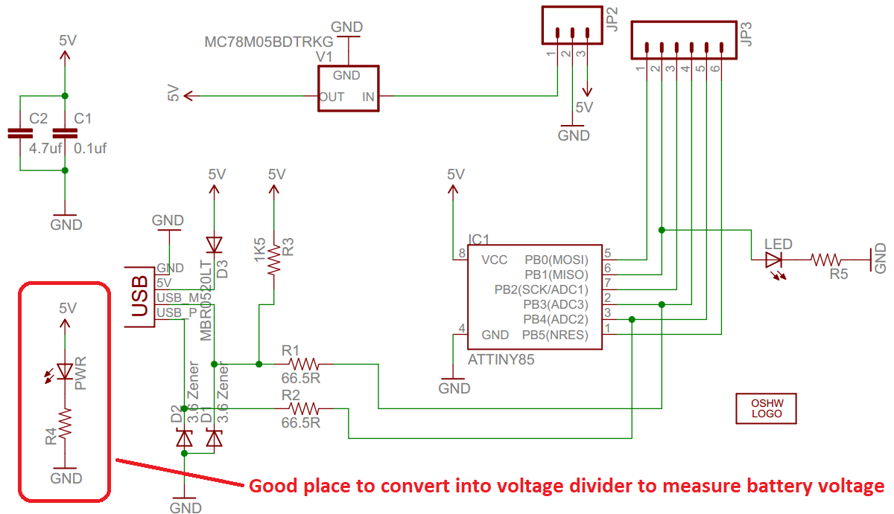

# RoombaChargeLimiter

Project of device that allow to use lithium batteries in Roomba without Charging Error 5

## Problem definition
 
Roomba 500 series and some others series uses NiCd or NiMh battery. Typical Roomba battery contains 12 cells. Voltage for NiMh battery is 0.9-1.6V per cell or 10.8-19.2V per battery.
Roomba charges battery with constant current around 1.3A until end of charge condition reached(like voltage dip or temperature threshold), then it start trickle charging(50 mA) to keep battery charged.
 
Lithium battery has range 3.0-4.2V per cell. So, the only one option that fit in original Roomba battery voltage range is 4 cell in series.
But still, it has narrow voltage range: 12-16.8V. More important Li-ion batteries has different charging method called CC/CV. Basically it is power supply with fixed 4.2V per cell and limited current(no more than 1C).
When battery out of juice it tries drain more current from power supply and current limited power supply drops voltage to limit current. When voltage reach 4.2V per cell(around 80% of battery capacity) battery starts drain less current and less current over time until battery is full.

Every lithium battery must contain Battery Monitoring System(BMS) to prevent overcharge and overdischarge. DIY batteries not an exception!
In case of overcharge/overdischarge BMS disconnects battery from charger/load.
That is exactly what happens when Roomba charges battery with constant 1.3A current and voltage on the battery exceed ~4.25V(depends on BMS) per cell. When battery disconnected Roomba detects Charging Error 5.

## Roomba 500 Series Charging Algorithm Overview

### High level sequence

1. Pre-charge cooling - Runs until battery temperature is less than 50C.
2. Charging(1.25A normal mode, 0.3A recovery mode) - Runs until an end of charge condition is true.
3. Post-charge cooling - Runs until battery temperature is less than 35C, or 2 hours passes.
4. Trickle(50mA) - Runs indefinitely. If the temperature goes above 42C, trickle turns off until the temperature drops below 40°C, then re-enables.

### End of charge conditions

Charging is terminated as soon as one of these conditions is true. These conditions are tested in variable times during charging.

* **Voltage Dip:** Voltage dips more than a 30 mV from the maximum voltage.
* **Temperature Slope:** Temperature increases by more than 0.5C per minute.
* **Coulombs Max:** If battery level is more than 2 times the nominal capacity.
* **Normal Charge Timeout:** 9 hours maximum in normal charge mode.
* **Recovery Charge Timeout:** 16 hours maximum in recovery charge mode.
* **Temperature Max:** Battery temperature exceeds 60C for at least 1 minute.
* **Voltage Max:** Pack voltage exceeds 21.6V for at least 1 minute.
* **Previous end-of-charge:** If a battery has been discharged by less than 150mAH since the last complete charge.

## The Idea

We need to tell somehow Roomba to stop charge when Li-ion battery is full. We can't easily exploit ways like 30mV dip or voltage exceeds 21.6V, but we can play around with a thermistor to cheat Roomba with battery temperature.
The best condition that we can exploit is "Battery temperature exceeds 60C for at least 1 minute".
Easiest way to cheat Roomba with temperature to add resistor in parallel to thermistor. It will drop resistance and increase measured temperature.
To have controllable resistor we must connect one side of resistor to thermistor positive terminal and another side of resistor to MCU pin configured as Open-Drain(in case of AVR MCU we can switch pin output/input mode back and forth to achieve same functionality).
Thermistor positive and negative terminals placed same way as battery terminals.

## Measurements

Roomba 500 Series Service Manual has table with allowed resistance range for thermistor. We can generate data for this thermistors. Also we can get average of this thermistors.
Also we can figure out how Roomba converts resistance to temperature. We can do this because Roomba has Open Interface(OI) that allow us to pull data like Charging State, Battery Voltage, Current, Temperature, Charge and Capacity.
We can connect potentiometer instead thermistor, then we will be able so set any known resistance and to see what temperature Roomba measures.

Results is pretty interesting:

More precisely at the high temperatures:

Up to 65C temperature conversion curve pretty same as average resistance. But after 65C it way different. Roomba expects way less resistance than real thermistors. Good for us - it allows wider resistance range.
Resistor value that I using in by battery is **2.2 kOhm**.

## Hardware & Schematic

Hardware must be accessible and cheap. Another requirement - it must work with voltage up to 22V. Best option in this case is **Digispark**(or clones). It is cheap($2) bard with linear regulator up to 35V. Also it can be programmed using Arduino IDE.

For output we can solder resistor to one of output pin. Also we need resistive divider to measure battery voltage. Fortunately, Digispark has place for that:

We don't need power LED(it will drain current from the battery) and we can use this place for resistor divider. Fortunately again, this resistor and LED placed very convenient. Remove trace using utility knife:

Double check that there no connection between diode and LED, otherwise you will apply input voltage to 5V rail and burn Digispark! Replace diode with 47kOh resistor(603 size), replace 1k resistor with 7.5kOhm resistor(also 603 size), add solder jump between Vin and LED place where connection to diode was. 
Then add wire between middle point of resistor divider to P2 on Digispark. All modifications:

Another hardware that I used for my battery:

* Battery Monitoring System: HX-4S-A20 rev 1.1 with FETs in SOIC-8 package

* Balance Board: Generic board 68 mA

## Software

* **AdcCoefficientTest:** Small programm to calibrate ADC coefficient. Programm device, connect to variable power supply and check that LED turns off is voltage is above THRESHOLD_MV(16.8V by default).  If it is not, play with ADC_REF_VOLTAGE_MV variable.
* **ChargeLimiter:** Main application. ADC_REF_VOLTAGE_MV must be calibrated!
* **RoombaSciBatteryMonitoring:** PC programm to dump battery parameters from Roomba via serial port.

## Pictures of battery

Battery box [files for 3D print at Thingiverse](https://www.thingiverse.com/thing:4505675)
